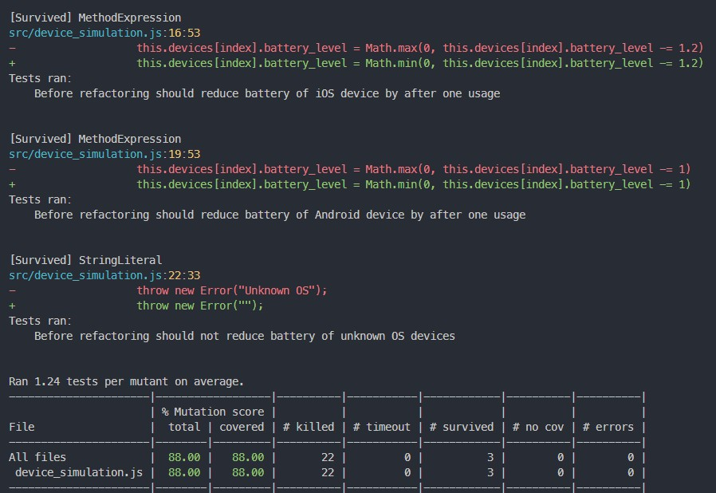

<div align="center">
<h1 aligh="center">Mutation Testing with Stryker</h1>
</div>

## Overview
This project shows how mutation testing adds value to your test suite beyond just looking at test coverage. Using mutation tests, it helps spot weak tests by making small changes to your code and checking if your tests catch them.

## Getting Started


### Installation
1. Install Node and npm (https://nodejs.org/en/download)
2. Go to project directory
3. Install packages/dependencies
```shell
npm install
```

### Usage
1. modify the `stryker.config.json` file to run mutation tests using a specific test file, otherwise it will use both test files (before and after refactoring)


2. Run mutation tests
```shell
npx stryker run
```

### Observations

#### Test coverage
* As show in the figure below, the test coverage was 100% even before the mutation test was run.


#### Before
* Running mutation tests on the 100% test coverage yielded a result of 88% (3 out of 22 mutations survived).
* The figure below shows the mutations that survived on the source file under test `device_simulation.js`.



#### After
* After refactoring the same tests to have a more strict assertions, the mutation tests yielded a 100% (0 mutation survived)

